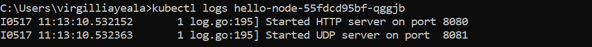
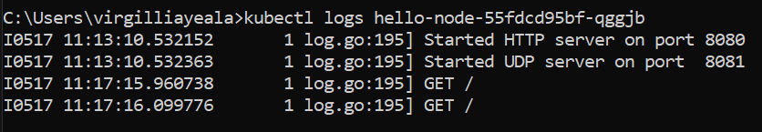

**Nama : Virgillia Yeala Prabowo
Kelas : ADVPROG-A
NPM : 2206829856**

#### Compare the application logs before and after you exposed it as a Service.
##### Sebelum

##### Sesudah

##### Penjelasan
Sebelum saya mengekspos aplikasi sebagai layanan, tidak ada catatan yang muncul dalam log saat saya membuka browser. Namun, begitu saya mengeksposnya, saya memberi akses kepada berbagai pengguna dari berbagai tempat untuk mengakses aplikasi tersebut. Akibatnya, setiap kali saya membuka aplikasi, sistem mencatat setiap interaksi yang terjadi dalam log. Ini mencakup informasi penting seperti siapa yang mengakses aplikasi, kapan akses dilakukan, apa yang diminta oleh pengguna, dan bagaimana aplikasi merespons permintaan tersebut.

#### Notice that there are two versions of kubectl get invocation during this tutorial section. The first does not have any option, while the latter has -n option with value set to kube-system. What is the purpose of the -n option and why did the output not list the pods/services that you explicitly created?
Jawabannya adalah perbedaan antara kedua sintaksis tersebut terletak pada penggunaan opsi -n. Opsi -n adalah singkatan dari "namespace". Penggunaannya penting jika terdapat banyak layanan yang berbeda yang memiliki nama yang sama dan tersebar di berbagai namespace. Dengan menggunakan opsi -n, kita mengarahkan perintah GET untuk berfokus pada namespace yang telah kita tentukan setelah mengikuti opsi -n.

